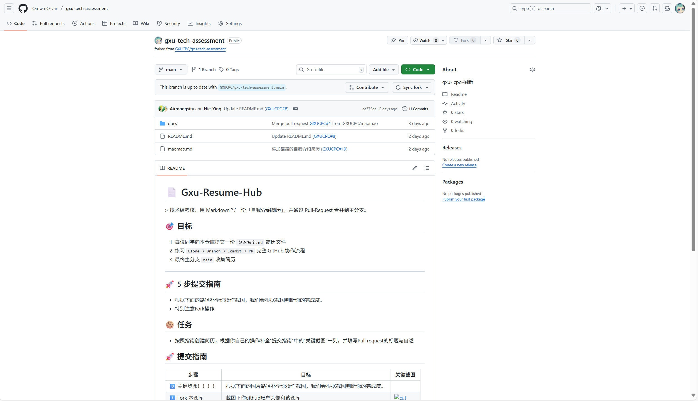
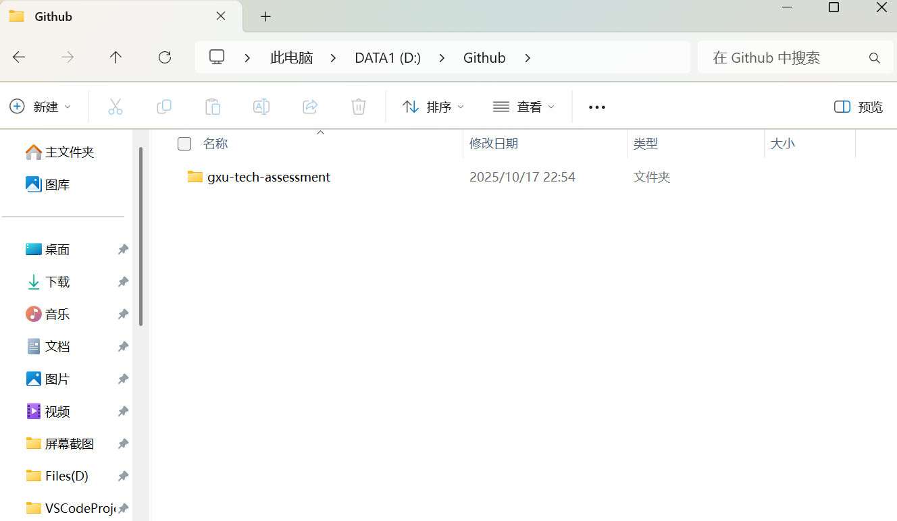
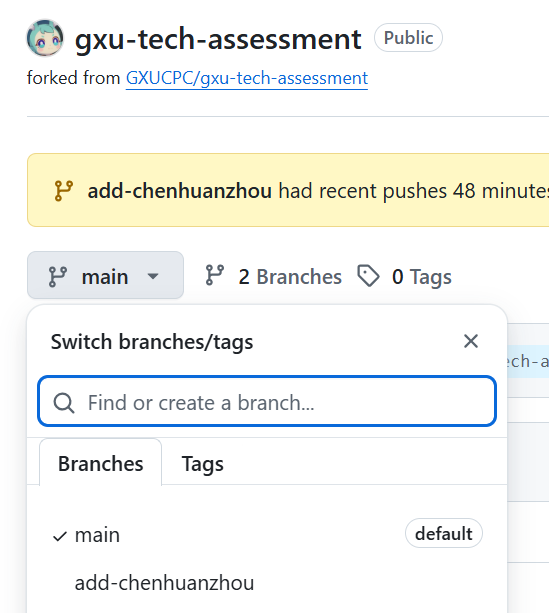

# 📄 Class-Resume-Hub
&gt; 班级协作第一课：用 Markdown 写一份「自我介绍简历」，并通过 Pull-Request 合并到主分支。

## 🎯 目标
1. 每位同学向本仓库提交一份 `你的名字.md` 简历文件  
2. 练习 `Fork → Branch → Commit → PR` 完整 GitHub 协作流程  
3. 最终主分支 `main` 收集全班简历，形成公开「人才库」

---

## 🚀 5 步提交指南（照抄即可）

| 步骤 | 目标 | 关键截图 |
|----|----|----|
| 1️⃣ 打开 本仓库 | 截图下你github账户头像和该仓库 |  |
| 2️⃣ Clone 到本地 | 下载代码，准备改文件 |  |
| 3️⃣ 新建分支 | 分支名格式 `add-名字简历` |  |
| 4️⃣ 写简历并提交 | 按模板写 `你的名字.md`，`git push` |  |
| 5️⃣ 发起 Pull Request | 填写 PR 标题+自述，等待合并 |  |

---

## 📝 简历模板（可直接复制）
在分支里新建文件 `resumes/你的名字.md`：

```markdown
# 自我介绍 - 张三

- 姓名：张三  
- 学号：2021123456  
- 专业：计算机科学与技术  
- 兴趣爱好：摄影、Rust、羽毛球  
- GitHub：[https://github.com/zhangsan](https://github.com/zhangsan)  
- 个人宣言：代码如诗，Bug 如画。